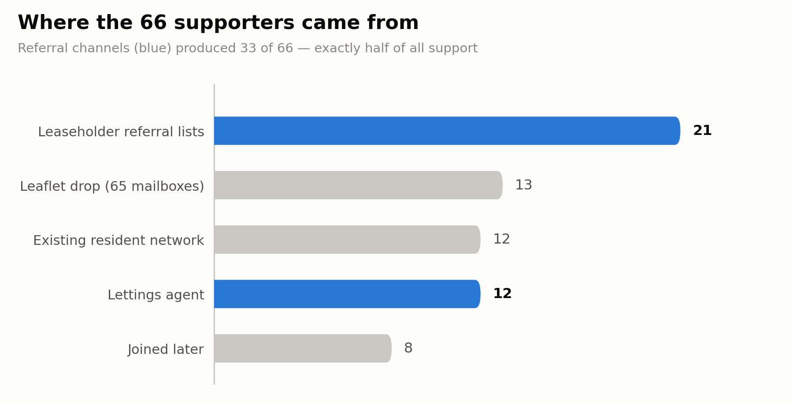
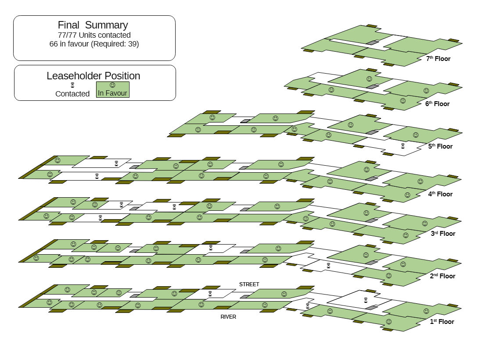

## Introduction
Harry Scoffin, the founder of Free Leaseholders, recently told a [Housing Committee hearing](https://www.youtube.com/watch?v=-6nLK1Kwj6w) that getting 50% of leaseholders in a large buy-to-let block to agree on anything is almost impossible. We got 86%, with nobody against. So I wanted to share how I rallied a coalition of mostly absentee landlords to exceed this figure so clearly, to take control of the block and rescue my equity - and how doing so ended up using a lot of the skills from past roles in presales and business transformation.

Late last year, I discovered that my apartment would be almost unsellable, as it was now one of the [estimated 37% of flats](https://thenegotiator.co.uk/news/regulation-law-news/a-third-of-flats-may-be-unsellable-in-latest-housing-crisis/) in the UK whose service charge now exceeds 1% of the property's value — the point at which lenders start refusing mortgages. When leaseholders of such properties have to sell, they are forced to sell at cash auction for a substantial discount. This was unacceptable.

So I decided to rally the other leaseholders to obtain Right to Manage - the legal right of a block of flats in this country to demand control of the management of the block. I had to forge a group of mostly remote leaseholders (some with a level of adversarial history) into a unified community, and keep it together while navigating a complex regulatory framework with a counterparty that had an inbuilt incentive to resist our efforts.

## Building the base of support
We needed the support of 39 units - at least 50% of the block had to be members of the RTM Company before we could claim. The immediate problem that we faced, was how to contact and get in touch with a group of leaseholders who did not live in the block, and whose contact details were unknown. From the start I decided against asking the incumbent managing agent - there was essentially no chance that they would help, and tipping them off might cause them to start their own campaign to undermine ours. To start with, I used my existing network. There was already a small community of resident leaseholders held together via an email group and a WhatsApp group. I'd personally managed to add several people to this community by actively engaging with unknown residents - purely because you never know when a connection might be mutually beneficial.

This gave us a starter group of 12 - with 39 needed and ideally up to a dozen more. My working assumption was to treat the remaining units as rented out. Now, one option for the next step might have been to download the titles for the remaining units, and write to the registered addresses.

I chose not to do this as the next step for several reasons:

  + The title registers cost £7 a time
  + People often forget to update their contact details on title registers when they move, and a look at property sales data showed that the majority of the units had not changed hands in 20 years
  + Letters are common and what with junkmail, the inclination is to dismiss an unexpected letter - "how can I get rid of this?". A mailshot, personally signed by another resident, stands out
  + Landlords are often in touch with their tenants and some even have cordial relations in place

So instead, I chose to do a personal mailshot - printing out 65 leaflets to place in each mailbox.

## Selling with the mailshot
The mailshot was essentially a sales pitch - as a tenant, why should you care, and why should your landlord care? In a case like this, you need a few carefully chosen talking points. Too many, and it feels like some hard-sell sales pitch on late night television. Too few, and you fail to persuade.

So I chose to make the following talking points:

  + If you are a tenant, rising service charges put financial pressure on your landlord to raise rents. Meanwhile, problems external to the flat are not fixed, affecting your quality of life
  + If you are a landlord, the value of your investment is being slowly eaten away

And on each leaflet was a request to pass on my contact details to the owner of the property.

65 leaflets went out; over the course of a month, 13 new contacts reached out and stated their support for the effort. With something like this, you have to accept that some people will be slow to respond. 

25 supporters, 39 needed.

## Moving on to referrals
Some people are natural connectors, and if you can convince them of your case, they will put you in touch with other potential supporters or sources of contacts. This effort proved no different. Two of the landlords had lists of other leaseholders from previous efforts to rally the community. 21 more supporters stated their support. 46 supporters with 39 needed. But ideally we wanted more.

Another leaseholder was in contact with the director of the lettings agent who handled most of the lettings in the block - passed my details, they called me and after I convinced them of the cause, they contacted all their landlords that I was not in touch with. 12 more supporters - 58 total, with 39 needed.

8 more were to join us over the coming months, but we had enough at this point.

## Establishing stakeholder credibility
At this point, we had commitments from enough leaseholders and questions of stakeholder management came to the fore. There were two specific groups to consider.

The first and most important stakeholder was the part-time caretaker. While not living on site, they knew a lot of what went on at the block, and it was only a matter of time before they heard about the effort and started questioning what it would mean for them. So I sat down with them and explained very carefully what we planned and how it would actually empower them. I took care to visit them regularly and update them on progress.

The second stakeholder management question was how to keep the support of the group of supporters that I'd rallied. For historical reasons, certain leaseholders were deeply suspicious of each other, and I needed to avoid being seen to take sides.

I foresaw two separate problems:

  + Having gained support, I needed to keep it until the claim went in. In particular, I needed to build up trust for when it came time to join the company
  + They might be concerned that I was making decisions to benefit myself to their own detriment

Each required its own separate strategy.

To keep people invested, I sent out regular email newsletters, explaining progress and what the next steps would be.

To avoid the suspicion of this being my one-man feathering of the nest, I established an advisory committee made up of volunteers to act as a sounding board, with its own separate email and WhatsApp groups.

This immediately provoked a challenge from a couple of leaseholders, who while unwilling to join this group felt that one who had would subvert the effort in order to reintroduce short-term letting in violation of the lease. I found myself spending significant time reassuring them that I was not inclined to allow this and in fact would have a statutory duty to enforce the lease provisions.

## Calling in a professional
So now it was time to form the company and start the claim process. The RTM process is notoriously [full of pitfalls](https://www.leaseholdknowledge.com/right-to-manage-or-right-to-endless-misery-in-the-courts/), and if the freeholder or incumbent managing agent decides to challenge, working through the courts can take years. You have to invite all leaseholders to join the company; get a single thing wrong and the claim is invalid. You have to notify all parties, and if you get anything wrong, the claim is invalid. And then the freeholder can demand a mountain of background paperwork, and if there are any discrepancies or errors, the claim is invalid. With all these pitfalls, we felt it was necessary to engage advisors. There are a range of companies that will help you through the RTM process, charging a wide range of fees.

We considered the key factors; the desire to ensure success so that we could immediately start work on reducing the service charge, and the fact that service charges were already in the mid 4-figures for most leaseholders. Given these, we engaged Shula Rich, one of the most recognised names in RTM advice provision. A key decision criterion was her stated approach of merely amending claims that were rejected for trivial reasons and resubmitting. This significantly reduced the risk of needing a lengthy and expensive challenge at the First Tier Tribunal, the section of the courts that deals with such disputes.

## Choosing the replacement
At the same time, we needed to choose a replacement managing agent. Some RTM efforts manage the block themselves, but for us, a 77-flat riverside block with 4 entrances and a caretaker needed a professional company.

We created an ITT and sent it to a number of candidate companies after a couple of review iterations with the advisory committee. We then had each member of the advisory committee score the companies across five weighted categories, creating a shortlist of three. Detailed examinations and follow up questions produced a front runner, who we eventually engaged to take over. As with our advisor, their stated experience in taking over from the incumbent was a key factor.

## The outcome
The claim was posted on the 4th of June. What with a weekend, deemed delivery was the 9th of June. The RTM regulations stated that the counterparties had a month to respond, so once we factored in another weekend and some leeway, we agreed a cutoff for response of the 13th of July. Again driven by the RTM regulations, the handover can only happen a minimum of 3 months after the response deadline. I chose to move it from Tuesday to Wednesday (to leave two clear working days between the weekends), so - the 14th of October.

As expected, the freeholder immediately responded with a request for evidence - we had to hand over no less than 79 pages of documentation for them to pick through for discrepancies.
On the 8th of July, the freeholder sent over their formal acceptance of the claim. Contrary to anecdote, they were highly professional at every step.

How much will the service charge come down by? We'll know once we have the new budget in place, but the consensus is that RTM cuts charges from 10% to 30% or even much more. A highly comparable block has roughly half the service charge levels.

## What I wished I'd done
I should have identified and recruited directors much earlier in the process. As it is, it sometimes feels like my fellow directors are only now finding their feet with the claim already accepted.

I also should have anticipated the tensions between certain leaseholders and worked to pre-handle them. The concerns raised could have been anticipated.

## Conclusion
A presales or business transformation effort requires the ability to craft an argument, reach stakeholders, manage stakeholders and navigate process and regulatory landscapes. All of these came to play in this effort. Going from 12 initial supporters to 66 needed a combination of cold approach, and networking - but just as in business, referrals win out every time. Looking to prehandle stakeholder objections was the right call, even if I failed to anticipate a key one - at the very least, the patterns put in place brought enough credibility to ride out that objection. Identifying the right suppliers with a traceable set of decisions also built trust. Last of all, simply being able to comprehend the process and describe it intelligently meant that the necessary notices did not provoke panic when they landed in leaseholders' mailboxes.

