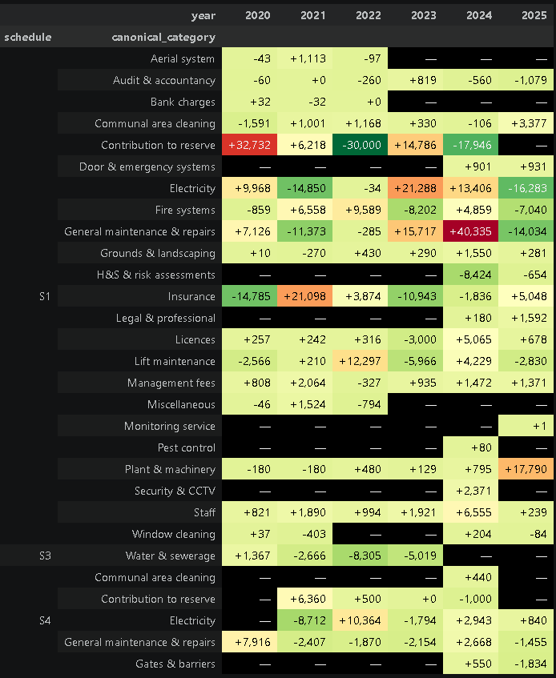
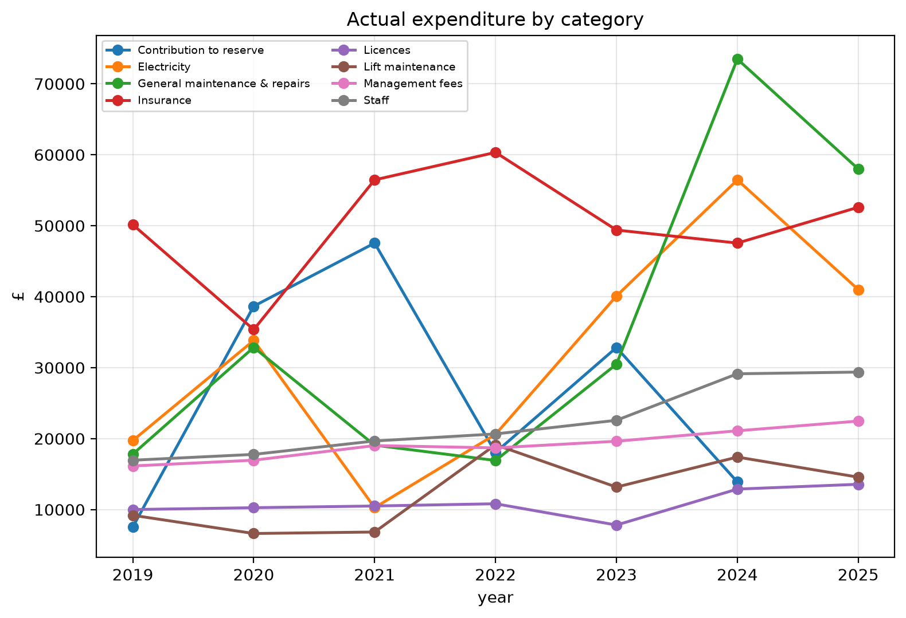
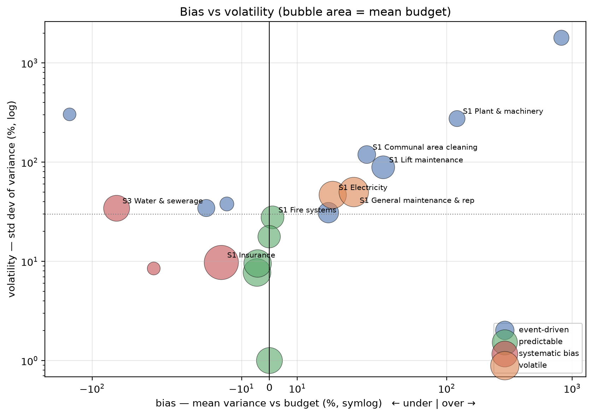

## Introduction
As described in my [previous post](https://peterharrad.github.io/Contributing-Factors/posts/2026/08/RH-RTMEffort/), I spent most of H1 2026 leading a Right To Manage effort for my apartment block. Now we directors need to start understanding the service charge - the history, the components and the areas to be wary of. I've used tools like pandas and Jupyter notebooks before, but I thought it would be interesting to see how Claude Code would do on such a task. Supporting files are [here](https://github.com/peterharrad/Service-Charge)

The exploration was useful in giving areas for us to look at, but also exposed some intriguing pitfalls of using AI for this kind of work. 

* Key points:
  + Don't trust the AI to find the right data without guidance
  + An AI-written redaction script leaked the names it was redacting — in a comment, a variable name, and an array literal
  + Lexical analysis is vulnerable to repeated text and small corpora of text
  + Expect a single request to provide a lot of analysis - be wary of it pushing you in a particular direction
  + Jupyter throws lots of graphs at you, the Claude Code interface throws lots of commentary at you. So what you need should guide the tool

## Getting the Data
I moved in 7 years ago, and had documents mostly covering that period. The first hiccup was that halfway through, our existing managing agent was bought by another company, with a different approach to presenting the accounts. The 2021 accounts were a bare ledger dump and there was no 2023 budget, so figures for those years come from the comparative columns of the following year's accounts. The apparent change of agent is a rename rather than a handover — [the same company throughout](https://find-and-update.company-information.service.gov.uk/company/06805193) — so the comparatives are the same organisation restating its own figures, not a successor reconstructing a predecessor's. Where I could check a comparative against the original, the carry-over was exact. All in all, I had actuals for 2019-2025, and budgets for 2020 and 2022-2026.  It felt like this was enough to start with. The accounts and budgets from 2024 also had commentaries, which opened the door to some extra analysis - to be discussed later.

## Getting the financial data
The early accounts to 2022 were scanned images. To start, I simply instructed Claude to extract the P&L for each year, from each file. Claude did an excellent job (zero transcription errors), but was most apologetic - explaining that the scanned files didn't separate out P&L into the different budget schedules that the block had. Which, on checking, turned out to be complete rubbish. Lesson - don't just check the figures that AI brings you, check if it simply didn't read far enough in the document. Fixed by rerunning the command but specifying the precise pages in the scanned document to look at.

The next issue was that the two sets of accounts had slightly different categories - e.g. the old one separated out insurance types, the new one aggregated them. Decision: the newer agent was the more pertinent data, so I had the AI aggregate the older data accordingly.

Lesson learned: check the data that AI extracts, but also check availability, despite what the AI tells you.

## Cleansing the commentary
With a post like this, it's natural that I might be expected to share the source data. Which means that I needed to be aware of confidentiality. In particular, where people's names and contact details were shown, as well as specific quotes that contractors provided, these had to be redacted. There was also a question of whether anything in the commentary could be sensitive to the block itself. 
  
So I had the AI create three scripts:

  + redact_docx.py - a simple matching script to remove names and contact information. No reason to feed spammers.
  + score_sensitivity.py - a heuristic to score each line on potential sensitivity based on what it discussed and produce a file for me to inspect
  + sanitise_docx.py - a script to clean out any contractual figures and remove any lines that the sensitive line analysis had thrown up

Simple enough, no? And if I hadn't intended to share the scripts it would have been fine. 

redact_docx.py helpfully listed the names and details for it to redact in the comments that had been generated at the top, and then listed the names in an array. Meanwhile, after I asked for sanitise_docx to remove a specific line that related to security, it had helpfully explained this removal in the comments and the code to do so was helpfully named in way that made it clear what information was being removed. 
Oops. So a couple of quick manual edits were in order. In practice, the time taken was probably equal to redacting the information manually... but this was useful learning for a future project that I'll be writing about. 

Lesson learned (or, rather, reinforced): Check the scripts that AI generates, not just the outputs. In retrospect, I should have explicitly told it to obfuscate the names of the relevant variables and functions.

## Financial Analysis
Two questions stood out for me in the service charge - which areas had the greatest growth, and which areas showed the greatest variance of actual versus budget?

Asking about growth areas produced an impressive set of graphs, with two standing out as particularly useful. As shown below, general maintenance, electricity, and plant and machinery all stand out as significant items and topics that the directors need to dig into. It's noticeable that reserve contributions are incredibly volatile - it seems like both agents used it as a smoothing function for the budget totals.

::: {#fig-budgetgrowth layout-ncol=2}

Two graphs showing the same culprits for service charge growth
:::

Variance tells a similar story. It seems clear that maintenance is not only one of the biggest contributors to service charge growth, but also one of the most unanticipated

## Commentary Analysis
Likewise, there were two areas that interested me in the commentary. Specifically, did the commentaries tend to claim success or failure on specific topics, and did the language become more handwavy and evasive for the same topics. As an experiment, I decided to perform this via the Claude Code interface, not the Jupyter notebook.

For the analysis of claimed success and failure, the commentary is negative 6 times more often than it's positive - perhaps understandable when trying to justify spiralling service charges. What's more interesting is the topic breakdown: Insurance is the most consistently negative presentation, while energy costs are presented as a relative success.

| Topic | Paras | Optimism score |
| :--- | ---: | ---: |
| Insurance | 10 | **-2.94** |
| Reserve fund | 8 | -1.75 |
| Water & pumps | 5 | -1.40 |
| Fire safety | 22 | -1.25 |
| Audit & accounting | 8 | **+0.75** |
| Electricity & energy | 19 | +0.25 |

More interesting was the evasive language analysis. A simple lexical analysis script produced the following, rather questionable results. Boilerplate and FAQ scored second in the list - and the top category only covered 58 words. Time for a rethink. 

| Topic | Paragraphs | Words | Terms | Evasiveness |
| :--- | ---: | ---: | ---: | ---: |
| General maintenance | 6 | 58 | 3 | 5.2 |
| Boilerplate FAQ | 25 | 309 | 15 | 4.9 |
| Security & access | 4 | 155 | 7 | 4.5 |
| Major works | 7 | 185 | 8 | 4.3 |
| Audit & accounting | 8 | 269 | 11 | 4.1 |
| Electricity & energy | 19 | 948 | 39 | 4.1 |
| Reserve fund | 8 | 440 | 17 | 3.9 |
| Lifts | 9 | 401 | 15 | 3.7 |
| Correspondence & reassurance | 28 | 604 | 22 | 3.6 |
| Fire safety | 22 | 1,155 | 40 | 3.5 |
| Water & pumps | 5 | 243 | 8 | 3.3 |
| Insurance | 10 | 572 | 18 | 3.1 |
| Car park & undercroft | 2 | 38 | 1 | 2.6 |
| Cleaning | 5 | 246 | 5 | 2.0 |
| Grounds & landscaping | 2 | 102 | 2 | 2.0 |
| Management fee | 4 | 58 | 1 | 1.7 |
| Service charge level | 10 | 225 | 2 | 0.9 |
| Billing & payment | 23 | 1,344 | 11 | 0.8 |

A quick examination showed that the boilerplate was repeated across all five files, biasing the result. Likewise, the single comment on general maintenance scores highly - but could just be due to chance.

Rebuilding the measure to deduplicate repeated text and drop thinly-populated topics moved boilerplate FAQ from second place to ninth, below almost every substantive topic — the original score was largely an artefact of the same standard passages recurring each year. On the cleaned figures electricity and energy tops the table at 3.8, with lifts and water and pumps also high; all of which show significant budget variance in the financial analysis. General maintenance and major works disappear from the analysis, which in some ways is telling - large areas of spend were simply skirted over.

| Topic | Paragraphs | Words | Terms | Evasiveness |
| :--- | ---: | ---: | ---: | ---: |
| Electricity & energy | 17 | 869 | 33 | 3.8 |
| Correspondence & reassurance | 14 | 332 | 12 | 3.6 |
| Lifts | 8 | 358 | 13 | 3.6 |
| Fire safety | 17 | 909 | 31 | 3.4 |
| Water & pumps | 5 | 243 | 8 | 3.3 |
| Billing & payment | 4 | 190 | 6 | 3.2 |
| Reserve fund | 5 | 254 | 8 | 3.1 |
| Insurance | 5 | 308 | 8 | 2.6 |
| Boilerplate FAQ | 12 | 699 | 16 | 2.3 |
| Cleaning | 4 | 211 | 4 | 1.9 |
| Unclassified | 19 | 171 | 1 | 0.6 |

## Conclusions
The analysis has highlighted some important areas for us to focus on. We need to dig into the electricity and understand what's driving the growth and unpredictability. The repeated unexpected variance in maintenance highlights that an attempt to understand expected lifetimes of different systems is long overdue.

Some other useful lessons fall out for future analysis using these tools.

It's often said that you should treat AI like an intern whose work needs to be thoroughly checked. Two examples came up in this effort. The AI did an excellent job at extracting data from the image files... yet needed to be told which page to look at. At the same time, the redaction scripts smoothly removed sensitive data - while exposing it in the source code. I've read that models are trained to write clear, self-documenting code — but this pushes in the opposite direction to confidentiality.

A more subtle point is the initial problems with the evasive language. What could be a useful metric was initially badly biased due to repeated text and small sample size.

A fourth point stands out - the tendency of Claude Code to attempt to use its initiative. Ask for a matrix of evasive words in the commentary by topic, and you get an entire essay opining on the results. Ask the Jupyter notebook to analyse variance of budget v actual, and get a swathe of tables and graphs. Not a problem, but a subtle trap to be wary of when using AI for this kind of work - the specific outputs can end up guiding you down a path instead of you guiding the outputs. Last of all, while this happens whether working via the Jupyter notebook or the Claude Code interface, it manifests in different ways due to the different constraints of the two interfaces. The Jupyter notebook throws a bunch of tables and graphs at you, while the Claude Code interface waxes lyrical with commentary.