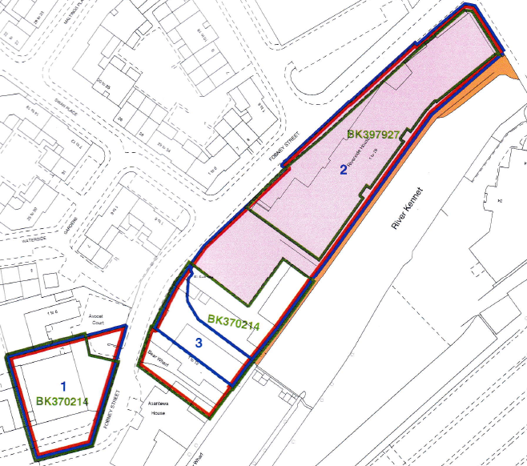

## Introduction
I suppose it was inevitable; having won our block's [RTM effort](https://peterharrad.github.io/Contributing-Factors/posts/2026/08/RH-RTMEffort/), multiple leaseholders contacted me to ask if they still needed to pay their service charge demand from the outgoing agent in full. Now, I know the lease pretty well, but decided to test the question on a few LLMs into which I'd fed the lease. I was horrified to get numerous answers on the question that were just plain wrong. Pointing the LLM in question to the clause that they'd ignored usually provoked a correction (not always), but this convinced me of the need to enable more accurate querying and analysis of the lease and other important documents - for me and for my fellow directors. So this blog outlines my journey of transforming a bunch of mostly scanned PDFs into a fully structured resource with tagging.

Key findings:
    - the major human value-add is understanding the macro structure of documents. AI is great at repeating tasks at scale, the holistic picture is something it struggles with
    - parallel to this is careful consideration on what to include - some information is just not appropriate to ingest
    - defining the guardrails in the instructions is critical. Having a set of test scenarios to iterate with ahead of time is how you check that they are working

## Choosing the design
The first consideration was how to distribute the documents. At some point I'll look into creating a full vector store and frontend, but initial investigations showed that this could easily turn into a very enjoyable and time-consuming diversion from more useful activities. So next I looked at ways to distribute it via a Claude Project or a Gemini Gem. 

The initial idea was to generate a bundle of concept files in line with Google's new Open Knowledge Format (OKF), that we could have the Project/Gem reference. But it turns out that input files have to be uploaded by hand in such cases - OKF really seems designed for exclusive use by agents. NotebookLM can look at a folder... but has no threaded conversations. Every option for providing an encapsulated solution had its own limitations.

So the eventual fallback was to provide single markdown files for each input document, albeit with each clause properly tagged using ideas borrowed from OKF. This gave me 10 files that I could share - within Gemini's upload limit for gems. Then my colleagues could upload them into whatever tool they chose.

## What to ingest
The next question was to select what information I should feed into this resource. The goal here is to provide an ongoing resource for directors to understand their responsibilities and options for taking action on various matters. This led to the following basic list of inputs:

  + Contractual Documents and regulations - leases, service agreements, articles of association and codes of conduct
  + Title registers - records of property coupled with listings of relevant contractual agreements that touch the property
  + Relevant legislation - not the actual text of legislation, but links to the correct version
  + Instructions - instructions to the LLM on how to reason using the information (e.g. quote specific lease clauses)



I decided to exclude a few types of information. 

First, documentation around building safety compliance - inspection results, regulations, and so on. Inspection results are transitory; the report comes, and remediations take place. Likewise, building regulations seem to be in constant flux at the moment, so since I did not want to adopt curating such information as an ongoing task, they had to be excluded from scope.

Second was spatial information such as maps and title plans. The idea is to allow directors to recieve accurate answers to their questions, and LLMs are currently limited in their spatial reasoning to support this. I decided to extract certain spatial information such as floor numbers for flats into a text file for accurate answers.

Last of all, it was tempting to provide information on the history of each flat and leaseholder as I've been in the block the longest and have had the most interaction with the other leaseholders. But brief reflection showed what a data protection nightmare this could become.

## Cleaning the documents
Before I could start ingesting, the files themselves needed cleanup. For the leases, I had a number of scanned PDFs. Our services agreement and the RICS code of conduct werer proper PDFs with text, and the titles were also PDFs of text. I used Claude Code to clean the files, which worked - mostly. There were small errors here and there, important for a legal document, so this highlights the need to check the outputs in such cases.

## Defining the document ingestion - contracts and guidelines
The largest group of documents - Contractual Documents and regulations - have a fairly standardised structure. The first section contain definitions of specific terms used in the document. The rest of the document is divided into chapters, sections, different documents call them differently but each contains a number of paragraphs that may have sub clauses.

```{mermaid}
%%{init: {'flowchart': {'rankSpacing': 90}}}%%
flowchart LR
  A[Document] --> B[Definitions]
  A --> C[Chapter]
  A --> D[Chapter]
  A --> E[Chapter]
  A --> F[...]
  D --> D1[Paragraph]
  D --> D2[Paragraph]
  D --> D3[Paragraph]
  D1 --> D11[Sub-Paragraph]
  D1 --> D12[Sub-Paragraph]
  D3 --> D31[Sub-Paragraph]
  D3 --> D32[Sub-Paragraph]
  D3 --> D33[Sub-Paragraph]
```

There was a concern over ingesting the lease - was it the same for each unit? As a check, I obtained someone else's lease and checked it against my own. Apart from some fascinating (but trivial) discrepancies in the scanning, the language was identical - giving me the confidence that I could use my lease as the reference.

## Defining the document ingestion - titles
Title registers are the other type of document to ingest, and they are also pretty standard in their structure. 

* Each has three sections:
  + The property register lists the property and any transfers
  + The proprietorship register lists who owns what and any agreements that affect disposal
  + The charges register defines agreements that touch the property in question

Each section is a list of numbered and dated entries.

```{mermaid}
%%{init: {'flowchart': {'rankSpacing': 90}}}%%
flowchart LR
  A[Title Register] --> B[A. Property register]
  A --> C[B. Proprietorship register]
  A --> D[C. Charges register]
  B --> B1@{ shape: docs, label: "List of entries"}
  C --> C1@{ shape: docs, label: "List of entries"}
  D --> D1@{ shape: docs, label: "List of entries"}
```

This one had me thinking for a long time. Arguably each separate entry is its own concept. But a given entry often does not give much information. For example:

| Entry | Date | Description |
|---|---|---|
| 4 | 2002-06-18 | An Agreement dated 2 May 2002 pursuant to Section 106 of the Town and Country Planning Act 1990 and Section 111 of the Local Government Act 1972 made between (1) Reading Borough Council and (2) Bewley Homes PLC supplemental to the Agreement dated 28 February 2000 referred to above contains provisions relating to the development of the land in this title and other land.<br>The said Deed also contains covenants.<br>NOTE: Copy filed under BK122099. |

This being the case, all that the AI could do is list an entry. I decided to treat each section as a concept for the purposes of OKF.

## Defining the document ingestion -  Legislation
In theory I could ingest various relevant legislation, but in practice the UK government is excellent at making legislation available online. For example, here is the [legislation defining the right to manage](https://www.legislation.gov.uk/ukpga/2002/15/part/2/chapter/1). The key thing to be wary of to use the current version of any act or statutory instrument, as they do get amended over time - the current template articles of association for an RTM company have gone through 4 iterations. The other caveat here then, is the need to be aware of freshness and provenance. 

So, each piece of relevant legislation becomes a separate concept (and hence file) in the bundle, where we can track the link to the actual resource along with relevant metadata.

## Defining the document ingestion - the instruction file
The last piece of the puzzle was the instruction file. Easy enough to create a first cut, but how to check operation? Here I defined half a dozen theoretical test questions, some based on queries that have already arisen, some theoretical. For example, could a leaseholder install [plugin solar panels](https://www.bbc.co.uk/news/articles/c4g3y6398nwo) on their balcony? 

Using these test cases, I was able to iterate on what instructions file would give the best result. The key points:

  + It's a search-and-citation aid, not a lawyer.
  + It answers only from the documents it's given.
  + Every statement is cited.
  + It surfaces differences but doesn't reconcile them.
  + It doesn't draw conclusions the documents don't.
  + Statute law is pointed to, not paraphrased.
  + It flags its known limits instead of answering past them.
  + Settled matters get written up.
  + The tone is plain, factual and brief.

## Creating the files
So with the document structure understood, what remained was the processing to generate the output files. To do this, I iterated on a processing prompt for each file, tweaking after each output run. For example, the prompt for the single-file individual lease is

      _One file, 'sample-lease.md', of 140 sections: "Definitions" and "Particulars" (no reference), then each clause, sub-clause and general-words section with its clause
      number as its reference, clauses 3, 4 and 5 listing their sub-clause numbers too, then each schedule paragraph with its paragraph number. Parts B, C and E of the Sixth
      Schedule have no reference. Links such as "Clause 7.10" and "Paragraph 3 of the Seventh Schedule" point to '#clause-07-10' and '#schedule-seventh-03'._

This illustrates the judgement required — clauses 3–5 keep their sub-clause numbers, these sections have no reference.

## Conclusion
This effort took a lot longer than expected... but the largest part of it was to understand the structure of the documents and then embed that understanding in the config files. Now the directors and I have a much more useful set of documents that we can use as we take the block forward. It was also a good exploration of where AI is a force multiplier, and where it can be a trap.

Anonymised outputs and associated code are at https://github.com/peterharrad/RHDirectorAssistant